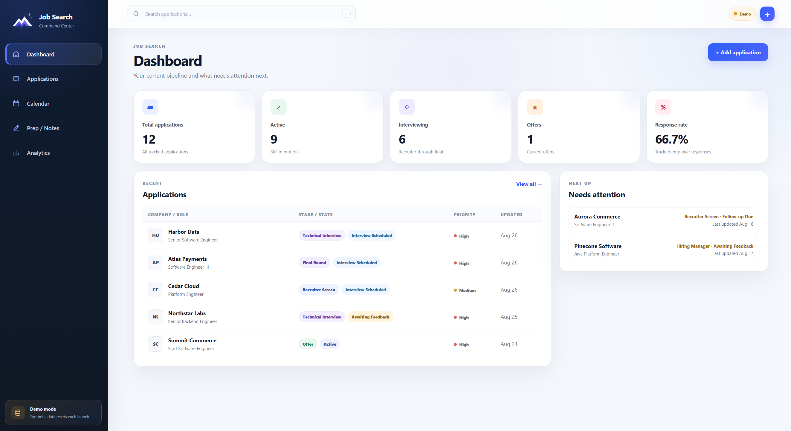
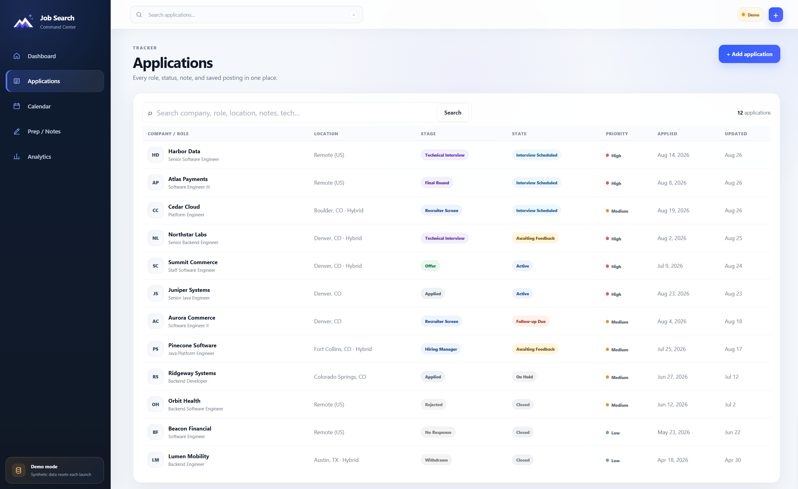
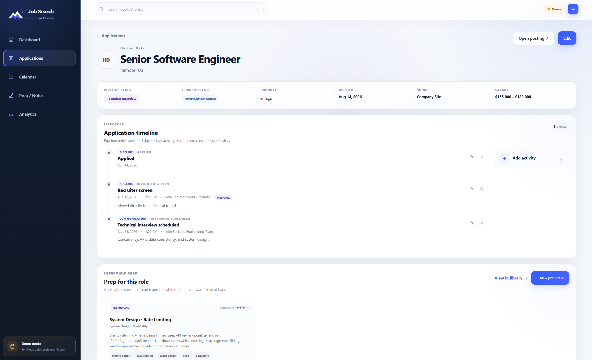
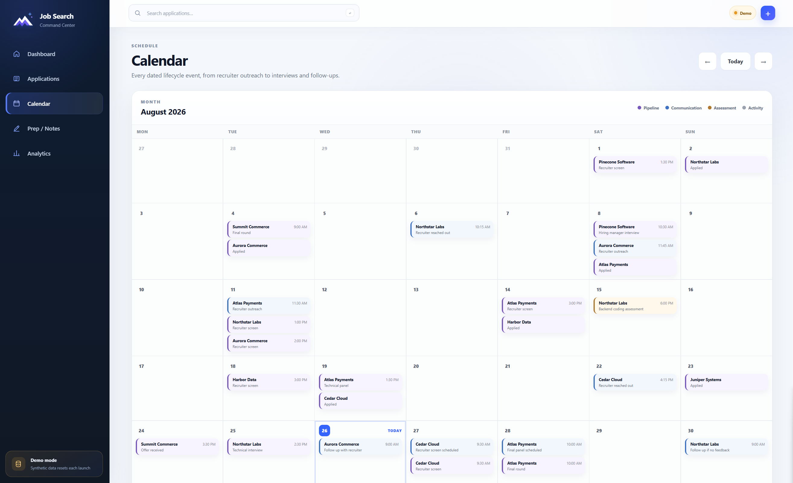
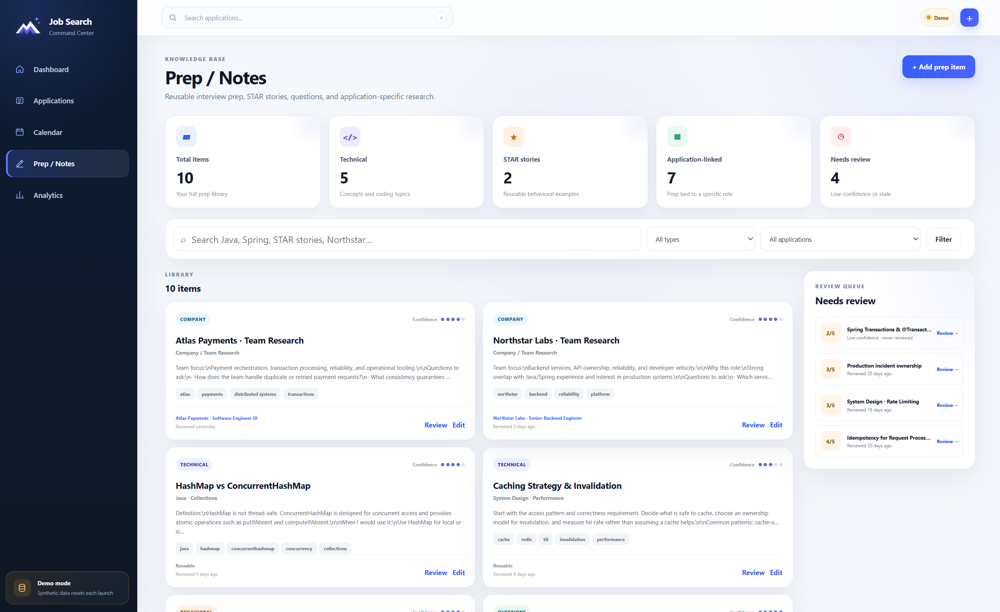
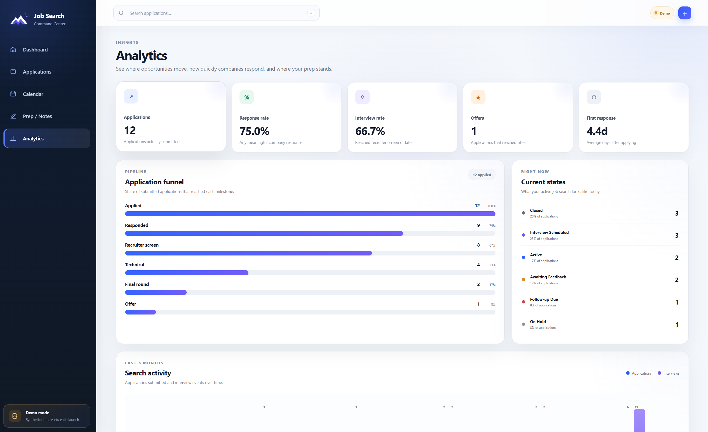

<div align="center">
  

# Job Search Command Center

**A local-first command center for applications, interview prep, follow-ups, calendar events, imports, and job-search analytics.**

Development version **1.4.0-SNAPSHOT** · Latest release **v1.3.0**
</div>

---

## Overview

Job Search Command Center is a single-user, local web application for managing the full lifecycle of a job search without spreading information across spreadsheets, notes apps, calendars, and browser tabs.

It is intentionally **local-first**. The application runs on your computer, uses a local SQLite database, and does not require hosting, an account, or a cloud database.

The project began as an application tracker and has grown into a small productivity system with:

- application tracking and search
- richer role metadata for work arrangement, experience requirements, structured career taxonomy, follow-ups, and archived cover-letter content
- centralized company management with shared domains, locally cached logos, initials fallback, and company-name alias cleanup
- pipeline-stage and current-state tracking
- chronological application lifecycles
- interview / assessment / follow-up calendar events
- reusable and application-specific interview prep
- confidence-based review scheduling
- data-quality coverage and missing-field cleanup links
- job-search funnel and timing analytics
- preview-first Excel / CSV import for historical application data
- conservative duplicate detection and merge controls
- a polished dashboard-style UI
- a sanitized demo mode for screenshots and public repository previews

## Features

### Dashboard

The landing page provides an at-a-glance view of the active job search:

- total applications
- active applications
- applications currently interviewing
- offers
- response rate
- recently updated applications
- applications that need attention
- a stale-application review queue for old active / awaiting-feedback records

### Application tracker

Applications can store:

- company, role, and optional company domain
- location
- work arrangement
- pipeline stage
- current state
- priority, including `Stretch` and `Skip`
- source
- original job-posting URL
- salary / compensation range
- years of experience required
- role family
- applied date
- next step / follow-up
- cover-letter usage and archived cover-letter text
- working notes
- a saved copy of the job description

The tracker supports text search across company, company domain, role, location, work arrangement, experience requirements, role family, source, state, next step, archived cover-letter text, notes, and saved job descriptions.

For larger histories, the application list also supports:

- filters for stage, state, priority, work arrangement, source, role family, and applied-date range
- sorting by recent update, oldest update, applied date, or company
- 25 / 50 / 100-row page sizes
- server-side pagination so large histories remain fast and scannable

### Company management

Version 1.3 adds a centralized **Companies** workspace so branding and company identity can be maintained once instead of application-by-application.

It can:

- group applications by normalized company name
- ignore punctuation and common legal suffix differences such as `Inc.` / `LLC` when grouping
- propagate one company domain across every application in a group
- fetch, refresh, upload, or remove one shared domain-keyed logo
- keep initials as the fallback when no logo is available
- show application/open-role counts and the latest application date per company
- merge separate company-name groups into a chosen canonical display name
- browse a compact, paginated company directory with search and cleanup filters
- open a company detail page with every application grouped under that company
- manage the shared domain, logo, canonical name, and aliases from the company detail page
- store company-level notes for research, culture context, recruiter history, and cross-application reminders
- suggest a known shared domain automatically when that company name is entered on an application form
- preserve application `updated_at` while performing company cleanup
- keep a company-level people directory for recruiters, hiring managers, interviewers, referrals, team members, and networking contacts
- store contact email / LinkedIn references, notes, and an optional local profile photo with initials fallback
- link one reusable company Person to multiple applications without duplicating the contact record
- see how many tracked applications reference each Person

Company-logo bytes remain stored locally in SQLite. Setting a domain or renaming a company from this workspace is treated as organization metadata rather than lifecycle activity. Company notes and people records are also local SQLite data and follow the normalized company identity when aliases are renamed or merged. Profile photos are optional and stored locally; LinkedIn URLs are references only and the app does not scrape LinkedIn profiles or photos.

Application detail pages can link any Person already saved under that company. The relationship is many-to-many: a recruiter or interviewer is stored once at the company level and can be associated with several applications. Linking or unlinking a Person does not alter application activity timestamps.

### Application materials

Long-form material is archived with the application but stays collapsed by default on the detail page so it does not dominate the working view.

The **Application Materials** panel currently stores and references:

- cover-letter usage (`Yes`, `No`, or `Not tracked`)
- the full cover-letter text when available
- a saved copy of the job description
- reusable files from the **Materials Library**, especially exact resume versions
- application-specific cover-letter files and one-off supporting documents

Reusable material is stored once in `material_files` and linked to any number of applications through `application_material_links`. Exact duplicate uploads are detected with SHA-256, so submitting the same resume to many jobs creates lightweight references instead of duplicate BLOBs. The original filename is preserved for downloads, while a separate library name and optional notes make versions easier to recognize.

Application-specific files remain in `application_attachments`. Both shared materials and attachments are limited to 10 MB per file, and metadata views avoid loading BLOB content until an actual download. Existing v1.3 Resume attachments are migrated automatically into the shared library without changing application activity timestamps.

### Company logos

Applications can optionally store a company domain such as `mastercard.com`. The detail page can then:

- fetch a logo from common favicon locations on the company's public website
- cache the resulting image directly in the local SQLite database
- accept a manual PNG, JPEG, WebP, GIF, or ICO upload when favicon discovery is not useful
- fall back to the existing company initials when no cached logo is available

Logo fetching only happens when explicitly requested. Cached images are shared by company domain, so multiple applications to the same company can reuse one locally stored logo without a cloud service or per-page third-party request.

### Pipeline stage vs. current state

The project deliberately separates **where an application has reached in the hiring process** from **what is happening with it right now**.

Pipeline stages include:

- Saved
- Applied
- Recruiter Screen
- Assessment
- Hiring Manager
- Technical Interview
- Final Round
- Offer
- Rejected
- Withdrawn
- No Response

Current states include:

- Active
- Interview Scheduled
- Awaiting Feedback
- Follow-up Due
- On Hold
- Closed

For example, an application can remain at `Technical Interview` while its current state is `Awaiting Feedback`.

### Application lifecycle

Each application has a chronological timeline. Events are grouped into four categories:

- **Pipeline** — applied, recruiter screen, technical interview, final round, offer, etc.
- **Communication** — recruiter outreach, interview scheduling, follow-ups
- **Assessment** — coding assessments and take-home assignments
- **Activity** — miscellaneous job-search activity worth preserving

Timeline events support:

- date and optional time
- event type
- title
- contact / person
- free-form notes
- editing and deletion

Changing an application's pipeline stage automatically records the new milestone in its lifecycle.

### Spreadsheet import

Version 1.1 adds a preview-first historical import flow for **Excel (`.xlsx` / `.xls`) and CSV (`.csv`)** trackers.

The importer is intentionally designed so uploading a file does **not** immediately modify the private SQLite database. The workflow is:

1. Select an Excel or CSV tracker.
2. Parse and validate the file locally.
3. Preview normalized application data.
4. Review status mappings and duplicate warnings.
5. Choose `Import separate`, `Merge with existing`, or `Skip` where appropriate.
6. Explicitly commit the selected rows.

The commit is transactional for the request, so a failed write is rolled back instead of leaving a partially completed import.

#### Supported tracker fields

The current importer recognizes the following tracker columns:

```text
Job Title
Company
Company Domain (optional)
Location
Work Arrangement
Compensation
YOE Req
Priority
Career Lane
Applied On
Updated Date
Status
Next Step / Follow Up
Job Link
Cover Letter?
Cover Letter Text (optional)
Notes
```

Only `Job Title`, `Company`, and `Status` are required for the file to be parsed. Missing or unrecognized values are surfaced as warnings during preview rather than silently discarded.

#### Status normalization

Spreadsheet language is translated into the application's **pipeline stage + current state** model before import. For example:

| Spreadsheet status | Application mapping |
| --- | --- |
| `Applied` | Applied / Active |
| `Ghosted` | No Response / Closed |
| `No Longer Under Consideration` | Rejected / Closed |
| `Technical Screen` | Assessment / Awaiting Feedback |
| `Technical Interview` | Technical Interview / Awaiting Feedback |
| `Final Interview` | Final Round / Awaiting Feedback |
| `Offer` | Offer / Active |
| `Skip` | Saved / Closed and skipped by default |

Unrecognized statuses are flagged during preview for review.

#### Duplicate handling

Duplicate handling is deliberately conservative:

- matching **job URLs** are treated as likely exact matches
- matching **company + role + location + applied date** is also treated as a likely exact match
- matching **company + role only** is treated as a possible duplicate and is **not** automatically merged

Likely exact matches default to `Merge with existing`; possible matches default to `Import separate` so legitimate applications to similar roles are not accidentally collapsed.

#### Historical lifecycle preservation

Historical dates are retained when possible:

- `Applied On` becomes the application's applied date and lifecycle `Applied` event
- `Updated Date` can become the historical date for the imported outcome / current milestone

This prevents historical applications from appearing as though they were all created on the day the spreadsheet was imported, and makes Calendar and Analytics useful immediately after migration.

Excel files are read with Apache POI's `DataFormatter`, which preserves displayed cell values such as `3-5` in a YOE column even when Excel internally represents the value as a date-like serial.

### Calendar

The calendar renders dated lifecycle events in a monthly view and distinguishes event categories visually.

It includes:

- month navigation
- today's date highlighting
- application and event labels
- event times when available
- upcoming activity for the next 30 days
- links from calendar entries back to the relevant application lifecycle
- focused views for **Actionable**, **Interviews**, **Assessments**, **Follow-ups**, and **All history**

The default **Actionable** view hides routine historical events such as Applied, Rejected, Withdrawn, and No Response so a large imported history does not overwhelm the working calendar.

### Prep / Notes knowledge base

Interview preparation is stored separately from application notes so it can be reused across opportunities.

Prep types include:

- Technical Topic
- STAR Story
- Interview Question
- Company Research
- General Note

Each prep item can include:

- category
- searchable tags
- full notes / talking points
- confidence from 1–5
- optional application ownership
- reusable links to multiple applications

This allows, for example, one `HashMap vs ConcurrentHashMap` prep item to be linked to multiple Java interviews while company-specific research remains attached to one role.

### Review workflow

Prep items have a lightweight study workflow. A review records:

- the review date
- updated confidence
- total review count

The review queue uses confidence to decide when material should return:

| Confidence | Meaning | Review behavior |
| --- | --- | --- |
| 1 | Need to learn | stays due |
| 2 | Shaky | stays due |
| 3 | Okay | due after 14 days |
| 4 | Strong | due after 30 days |
| 5 | Interview ready | due after 60 days |

The goal is to keep weak material visible without repeatedly surfacing topics that are already interview-ready.

### Analytics

Analytics are calculated entirely from the application's local data.

Current metrics include:

- application count
- response rate
- interview rate
- offers
- average time to first response
- application funnel
- current open-application state breakdown
- outcome mix across rejected, no-response, active, interviewing, withdrawn, and offer results
- six-month application / interview activity
- average time from application to key pipeline stages
- prep-library confidence and review health
- visual response / interview performance by priority
- visual response / interview performance by role family
- visual response / interview performance by work arrangement
- visual response / interview performance by application source
- percentage-point deltas against the overall search baseline
- response-to-interview conversion within each segment
- field-coverage indicators showing how much of the submitted history is actually tagged
- sample-size labels (`Stronger sample`, `Directional`, `Small sample`)
- consistent small-sample drawers that keep 1–2 application categories available without letting them dominate the main comparisons
- four current search-strategy signal cards that surface the strongest observed segment in each tracked dimension

The v1.2.0 strategy cards deliberately avoid treating one-off wins as conclusions: fewer than three applications is flagged as a small sample, 3–9 is directional, and 10+ is treated as a stronger sample. These are descriptive signals from local history, not predictions.

Analytics become more useful as more application history is entered or imported.

## Local-first design and privacy

There is no user account or hosted backend.

By default, SQLite stores the application data in:

```text
jobsearch.db
```

The database is created in the application's working directory (normally the project root when run from IntelliJ).

`jobsearch.db` and its SQLite sidecar files are ignored by Git, so your real job-search data should not be committed to a repository.

For backup, stop the application and copy `jobsearch.db` somewhere safe.

Spreadsheet imports are parsed by the locally running Spring application. Import files are not uploaded to an external service by this project.

Company-logo fetching is the one intentionally networked helper in the core app: it runs only when you press **Fetch from domain**, requests common icon paths from the public company domain you saved, and then stores the resulting image bytes locally in SQLite. Normal page rendering uses the cached database copy rather than an external logo URL.

### Safe demo mode

The repository also includes a separate **demo profile** for screenshots, portfolio previews, and public repository evaluation. Demo mode:

- uses `demo-jobsearch.db` instead of `jobsearch.db`
- runs on port `8081` instead of `8080`
- contains only fictional companies, contacts, roles, notes, and prep material
- resets the synthetic dataset every time demo mode starts
- never reads or modifies the private `jobsearch.db`

Both SQLite files are ignored by Git. This means you can keep the private app running on `http://localhost:8080` and launch the demo independently on `http://localhost:8081`.

## Screenshots

> All screenshots use the built-in demo mode with synthetic data. No personal job-search information is included.

### Dashboard

A quick overview of the current pipeline, response metrics, recent applications, and opportunities that need attention.



### Application lifecycle, application details & calendar

| Application lifecycle | Application details | Calendar|
| --- | --- | ---|
| Track each opportunity from application through interviews, follow-ups, and final outcome. | Keep role details, status, notes, job posting, linked prep, and lifecycle history together in one place. | See interviews, assessments, recruiter activity, and follow-ups in monthly view. |
|  |  |  |

### Interview prep & analytics

| Prep / Notes | Analytics |
| --- | --- |
| Build a reusable knowledge base of technical topics, STAR stories, company research, and interview questions. | Understand funnel conversion, response rates, pipeline velocity, interview activity, and prep health. |
|  |  |

## Tech stack

| Layer | Technology |
| --- | --- |
| Language | Java 21 |
| Framework | Spring Boot 4.1.1 |
| Server-rendered UI | Thymeleaf |
| Web | Spring Web MVC |
| Database access | Spring JDBC / `JdbcTemplate` |
| Database | SQLite |
| Spreadsheet import | Apache POI / Apache Commons CSV |
| Validation | Jakarta Validation / Spring Validation |
| Testing | Spring Boot Test / JUnit |
| Build | Maven |
| Frontend | HTML, CSS, minimal vanilla JavaScript |

The project intentionally avoids a separate SPA/frontend build pipeline. There is no React, Node, npm, or external web server required.

## Architecture

The application follows a familiar Spring layered structure:

```text
Browser
  │
  ▼
Controller
  │
  ▼
Service
  │
  ▼
Repository / JdbcTemplate
  │
  ▼
SQLite (`jobsearch.db`, or isolated `demo-jobsearch.db` in demo mode)
```

The import flow adds a preview step before persistence:

```text
Excel / CSV
    │
    ▼
ApplicationImportService
    │
    ├── parse + normalize
    ├── validate
    ├── detect duplicates
    │
    ▼
Import Preview
    │
    ▼ explicit confirmation
Transactional Commit
    │
    ▼
SQLite + historical lifecycle events
```

The main data tables are:

| Table | Purpose |
| --- | --- |
| `job_applications` | one row per tracked role, including richer role metadata, application materials, and import source |
| `company_logos` | locally cached company-logo image data keyed by normalized domain |
| `company_notes` | reusable company-level notes keyed by normalized company identity |
| `company_contacts` | company-level people records, including optional locally stored profile photos |
| `application_contact_links` | many-to-many links between company People and applications |
| `material_files` | reusable resume/material file BLOBs, deduplicated by SHA-256 |
| `application_material_links` | many-to-many links between reusable materials and applications |
| `application_attachments` | application-specific Cover letter / Other files stored as SQLite BLOBs |
| `application_events` | lifecycle / calendar events |
| `prep_items` | reusable and role-specific prep material |
| `prep_item_links` | many-to-many links between reusable prep and applications |

The schema is created from `src/main/resources/schema.sql`. A small startup migration runner handles columns and tables introduced after the earliest project versions, including the richer v1.1 application fields, v1.1.2 company/material columns, v1.3 taxonomy/company/people/attachment storage, and the v1.4 shared-material and Person ↔ Application relationships.

## Project structure

```text
src/main/java/com/brianna/jobsearch/
├── config/
│   ├── DatabaseConfig.java
│   └── DemoDataConfig.java
├── controller/
│   ├── AnalyticsController.java
│   ├── AppModeAdvice.java
│   ├── CalendarController.java
│   ├── DashboardController.java
│   ├── JobApplicationController.java
│   ├── MaterialLibraryController.java
│   ├── CompanyManagementController.java
│   ├── DataQualityController.java
│   ├── NormalizationController.java
│   └── PrepController.java
├── model/
│   ├── ApplicationAttachment.java
│   ├── ApplicationAttachmentType.java
│   ├── MaterialFile.java
│   ├── MaterialType.java
│   ├── CompanyContact.java
│   └── importing/
│       ├── ApplicationImportPreview.java
│       ├── ApplicationImportResult.java
│       ├── ApplicationImportRow.java
│       ├── DuplicateMatchType.java
│       └── ImportDecision.java
├── repository/
│   ├── ApplicationAttachmentRepository.java
│   ├── ApplicationContactRepository.java
│   ├── MaterialRepository.java
│   ├── CompanyManagementRepository.java
│   ├── CompanyLogoRepository.java
│   └── ...
├── service/
│   ├── AnalyticsService.java
│   ├── ApplicationAttachmentService.java
│   ├── ApplicationContactService.java
│   ├── MaterialService.java
│   ├── ApplicationImportService.java
│   ├── CompanyLogoService.java
│   ├── CompanyManagementService.java
│   ├── JobApplicationService.java
│   └── PrepService.java
├── JobSearchDashboardApplication.java
└── JobSearchDemoApplication.java

src/main/resources/
├── static/
│   ├── css/app.css
│   └── images/job-search-logo.svg
├── templates/
│   ├── applications/
│   │   ├── detail.html
│   │   ├── form.html
│   │   ├── import.html
│   │   ├── import-preview.html
│   │   └── list.html
│   ├── prep/
│   ├── analytics.html
│   ├── calendar.html
│   ├── dashboard.html
│   ├── materials.html
│   └── fragments.html
├── application.properties
├── application-demo.properties
├── demo-data.sql
└── schema.sql

src/test/java/com/brianna/jobsearch/
├── config/
│   └── DatabaseMigrationTest.java
├── model/
├── controller/
│   └── JobApplicationControllerTest.java
├── repository/
│   ├── ApplicationContactRepositoryTest.java
│   ├── CompanyManagementRepositoryTest.java
│   └── MaterialRepositoryTest.java
└── service/
    ├── MaterialServiceTest.java
    └── ...
```

## Getting started

### Prerequisites

You need:

- **Java 21**
- **IntelliJ IDEA** with Maven support, or any terminal that can run the included Maven Wrapper

No Node/npm tooling is required.

### IntelliJ IDEA — recommended

1. Clone or download the repository.
2. Open the repository root in IntelliJ.
3. Allow IntelliJ to import the Maven project.
4. Open:

   ```text
   src/main/java/com/brianna/jobsearch/JobSearchDashboardApplication.java
   ```

5. Run the `main()` method, or create an **Application** / **Spring Boot** run configuration using:

   ```text
   com.brianna.jobsearch.JobSearchDashboardApplication
   ```

6. Open:

   ```text
   http://localhost:8080
   ```

A convenient IntelliJ run configuration can be named `Job Search Dashboard` so future starts are just one click on the green Run button.

### Demo mode — recommended for screenshots

For a public-safe version of the app, run:

```text
com.brianna.jobsearch.JobSearchDemoApplication
```

In IntelliJ, create a second **Application** run configuration named `Job Search Demo` using that main class. Then open:

```text
http://localhost:8081
```

The top bar and sidebar explicitly show **Demo mode** so it is easy to tell which environment is open. The demo database is rebuilt from `src/main/resources/demo-data.sql` on every launch.

The generated dataset includes:

- 12 fictional applications across different pipeline stages and states
- recruiter outreach, assessments, interviews, follow-ups, final rounds, and an offer
- past and upcoming calendar activity
- multiple application sources for source-performance analytics
- normalized career taxonomy plus synthetic company contacts for v1.3 organization workflows
- two synthetic reusable resume versions linked across several applications to demonstrate shared-material storage
- reusable technical prep, STAR stories, company research, and review-due items

Because the demo profile uses a separate database and port, it is safe to use for README screenshots without exposing the contents of your personal job search.

### Maven Wrapper / command line

The repository includes a Maven Wrapper pinned to Maven 3.9.16, so a separate global Maven installation is not required. The first wrapper run downloads the pinned Maven distribution into the user's Maven cache.

On macOS / Linux:

```bash
./mvnw spring-boot:run
```

On Windows:

```powershell
.\mvnw.cmd spring-boot:run
```

Run the sanitized demo profile by adding `-Dspring-boot.run.profiles=demo`. The private app opens on port `8080`; the demo opens on port `8081`.

Run the full verification build with:

```bash
./mvnw clean verify
```

`verify` runs the automated test suite and generates a JaCoCo HTML coverage report at:

```text
target/site/jacoco/index.html
```

To create and run the current development JAR:

```bash
./mvnw clean package
java -jar target/job-search-dashboard-1.4.0-SNAPSHOT.jar
```

A global Maven installation still works, but the wrapper is the preferred development and CI path so local builds and GitHub Actions use the same Maven version.

## Build quality and CI

Version 1.4 starts with an engineering-safety baseline before the next product features:

- Maven Wrapper for reproducible local and CI builds
- JaCoCo coverage reporting during `verify`
- GitHub Actions on every push and pull request using Java 21 / Eclipse Temurin
- regression tests around application lifecycle behavior, attachment safety, and database migrations
- branded 404 / 500 pages instead of the default Spring error surface

Coverage is initially informational rather than a hard percentage gate. The goal is to increase meaningful protection around user-data behavior before enforcing a numeric threshold.

## First-use workflow

A useful first pass through the app is:

1. Add an application manually, or open **Applications → Import** to migrate an existing Excel / CSV tracker.
2. Review status normalization, warnings, and duplicate decisions before approving an import.
3. Record recruiter outreach, assessments, interviews, and follow-ups on application lifecycles.
4. Set the current application state independently from the pipeline stage.
5. Add company-specific research under **Prep / Notes**.
6. Add reusable technical topics and STAR stories.
7. Link relevant reusable prep to applications.
8. Use **Review** to update confidence as interview prep improves.
9. Use **Calendar** for dated activity and **Analytics** for funnel / timing trends.

## Development notes

### Template and static-resource changes

Thymeleaf caching is disabled for local development:

```properties
spring.thymeleaf.cache=false
```

If a change still appears stale:

1. stop the application
2. run `./mvnw clean package` (or the equivalent goals from IntelliJ's Maven tool window)
3. restart
4. hard-refresh the browser (`Ctrl+Shift+R` on Windows)

### Demo-data changes

`demo-data.sql` should contain **only synthetic data**. Avoid copying values from the private database into the demo seed, even temporarily. The demo launcher intentionally reseeds the demo database each time it starts so screenshots are repeatable and local demo edits are disposable.

When adding a feature that depends on structured data, update the demo seed when useful so public screenshots continue to exercise the feature.

### Database changes

Because this is a local-first project, schema changes should be backward-safe whenever possible. `schema.sql` uses `CREATE TABLE IF NOT EXISTS`, and `DatabaseConfig` contains lightweight startup migrations for older local databases.

When changing the schema, always test against both:

- a new empty database
- an existing database containing application / timeline / prep data

### Import changes

The current importer deliberately uses a known tracker vocabulary rather than guessing arbitrary column meanings.

When changing import behavior:

- keep the preview read-only
- keep duplicate matching conservative
- preserve historical dates where available
- use displayed Excel values rather than raw numeric serials
- test `.xlsx` and `.csv` normalization
- verify against both an empty database and a database containing likely duplicates

`ApplicationImportServiceTest` covers core import normalization and duplicate-detection behavior.

## Repository privacy and release hygiene

The repository is designed so local personal data stays out of source control.

Before committing or publishing changes:

1. Confirm `jobsearch.db`, `demo-jobsearch.db`, and SQLite sidecar files are not staged.
2. Do not commit real application spreadsheets or exports unless they are intentionally sanitized.
3. Use `JobSearchDemoApplication` for README screenshots and public examples.
4. Do not commit screenshots containing real recruiter names, interview details, salary information, or other personal job-search data unless intentionally sanitized.
5. Keep `demo-data.sql` synthetic.

A normal development cycle is:

```bash
git status
git add .
git commit -m "Describe the change"
git push
```

## Current limitations

The application is intentionally a local, single-user application. It includes a public-safe demo profile and preview-first historical imports, but does **not** currently include:

- authentication or multi-user support
- cloud hosting / cloud database
- email parsing
- Google Calendar synchronization
- automatic job-posting imports
- global cross-app search
- arbitrary spreadsheet column mapping
- import-batch history / one-click import undo
- export / backup UI
- global People directory and direct person-to-application linking
- dark mode

Those and other ideas are tracked in [`NEXT-STEPS.md`](NEXT-STEPS.md).

## Roadmap

See [`NEXT-STEPS.md`](NEXT-STEPS.md) for the prioritized product, analytics, automation, UX, and engineering backlog.

## What’s new in active v1.4 development

v1.4 now includes a **Materials Library** for reusable resume versions, direct People ↔ Application links, and a redesigned Application Detail overview. A resume is now stored once in SQLite and linked to every application where it was submitted. SHA-256 duplicate detection prevents byte-identical files from being stored again, and the library shows how many application references reuse each physical file. Existing v1.3 Resume attachments migrate into this model automatically while cover letters and other application-specific files stay attached directly to their application.

The v1.4 engineering baseline also adds Maven Wrapper support, JaCoCo coverage reporting, GitHub Actions CI, branded 404/500 pages, and a growing set of data-safety regression/migration tests. The active application taxonomy is now consistently presented as Role Family / Industry / Focus; the old free-form `career_lane` value is retained only as legacy import/migration context.

## What’s new in v1.3

Version 1.3 includes the Data Quality workspace, structured career taxonomy, a review-before-write Normalization Center, centralized Company Management, company-level People, and SQLite-backed application attachments. Existing free-form Career Lane values are preserved while bulk mapping can assign a broad Role Family, Industry / Domain, and optional Focus without changing lifecycle timestamps. Source and Work Arrangement labels can also be normalized in bulk, Career Lane analytics continue to use the normalized Role Family field, and company domains/logos can now be maintained once across grouped applications. Company pages have also become working spaces with grouped application history, reusable company notes, and a company-level people directory with optional locally stored profile photos.

The taxonomy is intentionally broad: role families describe the kind of engineering work, industry/domain captures business context, and detailed concepts such as AI, distributed systems, fraud, payments modernization, IAM, or recommendation systems belong in Focus. The enum set was expanded against the historical tracker before bulk normalization, while the preserved original tags remain available as source context.

## Version

Current release: **1.3.0** · Active development: **1.4.0-SNAPSHOT**

Version 1.3.0 builds on v1.2 search-strategy analytics with Data Quality, structured career taxonomy, bulk normalization workflows, centralized company organization/branding, company-level people tracking, and exact application-file archiving. Career Lane analytics use the normalized Role Family field; existing free-form Career Lane tags remain preserved as source context even after bulk mapping.
